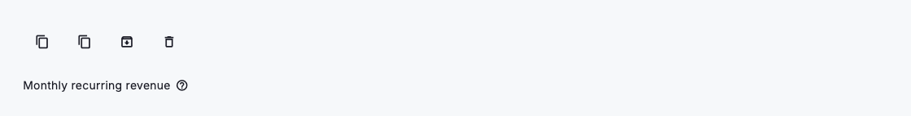
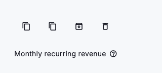

# Tooltip

A tooltip surfaces a short, on-demand hint for the element it wraps — shown on hover for pointer devices and on long-press for touch. Wrap any widget in `DsTooltip` and give it a `message`; after a brief delay a dark, inverted bubble floats above the neighbouring content, reading its colours, radius and shadow straight from the active theme so it matches both light and dark skins. It is best for naming an icon-only control or clarifying a terse label — supplementary help that a fully-labelled interface would never need. The bubble prefers to sit below its child, flips to the opposite side when space runs short, and caps its width so longer copy wraps rather than overflowing down to a 320dp phone.



*Desktop (1280dp)*



*Small phone (320dp)*

## Guidelines

**Do**

- Reserve tooltips for icon-only controls or terse labels that need a name.
- Keep the message to a few plain words — a noun or short verb phrase.
- Rely on the built-in hover and long-press triggers; both are automatic.
- Trust the default `preferBelow` placement and let it flip when space is tight.
- Let the message double as the accessible label for the wrapped control.

**Don't**

- Don't hide essential information or actions that a user must have to proceed.
- Don't attach a tooltip to a control that already has a clear visible label.
- Don't write sentences or paragraphs — long copy belongs in inline help.
- Don't place interactive elements or links inside the bubble.

## Example

```dart
DsTooltip(
  message: 'Copy to clipboard',
  child: IconButton(
    icon: const DsIcon(icon: Icons.copy),
    onPressed: () {},
  ),
);
```

## See also

- [Icon](icon.md)
- [Link](link.md)
