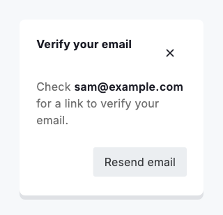

# Verify email

`DsVerifyEmailCard` is a compact reminder to confirm an email address, usually shown over a dimmed page in a `DsTakeover` rather than as a hard gate. It holds two states in one surface: a check-your-inbox prompt with a resend action, and an email-verified confirmation with a continue action. The caller owns which state is shown, so the card is a pure readout of a verification the surrounding flow drives.

The card is controlled and runs no timers. While `verified` is false it points the user at their inbox, with the `email` emphasised in the copy and a secondary resend action that shows a busy state through `resendPending`. Verify the address in your own state, from a real inbox round-trip or a simulated delay in a demo, then rebuild with `verified: true` and the card flips to its confirmation and a primary continue action.

The corner close is honest about what it does. In the inbox state it appears only when you pass `onClose`, and dismisses the reminder without verifying. In the verified state it routes to `onContinue` instead, so closing a confirmed card completes the step rather than throwing the confirmation away. When the card flips to verified its heading is announced as a live region, so a screen-reader user hears the outcome.


*Desktop (1120dp)*



*Small phone (320dp)*

## Guidelines

**Do**

- Host the card in a DsTakeover so the page behind it is blurred and inert while the reminder is up.
- Own the verified flag in your own state and rebuild the card with it, rather than expecting the card to verify itself.
- Pass resendPending while a resend is in flight so the action cannot fire twice.
- Give onClose only where dismissing without verifying is allowed; leave it off to keep the reminder until it is met.

**Don't**

- Do not treat the card as a gate the user cannot pass; it is a reminder, and the flow decides what verification blocks.
- Do not start a timer inside the card to fake verification; drive the state change from the caller.
- Do not reword the body to bury the address; the emphasised email is what tells the user where to look.

## Example

```dart
DsTakeover(
  background: dashboard,
  child: DsVerifyEmailCard(
    email: user.email,
    verified: emailVerified,
    resendPending: resending,
    onResend: _resendLink,
    onContinue: _dismissAndContinue,
    onClose: _dismiss,
  ),
);
```

## See also

- [Takeover](takeover.md)
- [Setup guide](setup-guide.md)
- [Onboarding](onboarding.md)
